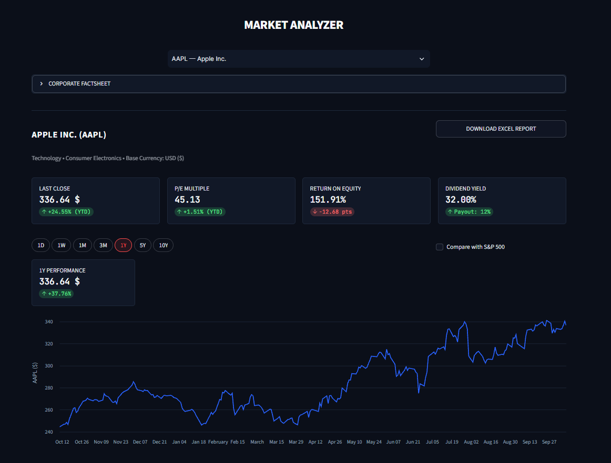
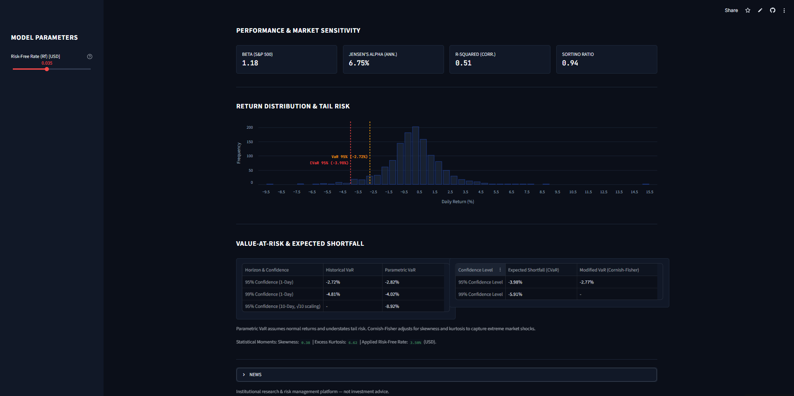

# Market Analyzer

[](https://github.com/asholani/market-analyzer/actions/workflows/tests.yml)


A Streamlit dashboard combining **fundamental analysis** and **quantitative market-risk
assessment** for stocks and commodity futures.

**Live demo:** _add your Streamlit Cloud link here_




## Features

**Fundamental research**
- Revenue and net income over 5 fiscal years, with YoY growth and CAGR
- Piotroski F-score (up to 9 criteria)
- Leverage: debt-to-equity and interest coverage
- Valuation: current P/E vs its own 5-year average, free cash flow yield
- Analyst consensus: target price, upside, buy/hold/sell split

**Quantitative risk**
- Annualized volatility, maximum drawdown, Sharpe and Sortino ratios
- Historical, parametric and Cornish-Fisher Value-at-Risk (95% / 99%)
- Expected Shortfall (CVaR)
- CAPM beta, Jensen's alpha and R-squared against a regional benchmark
  (S&P 500, CAC 40, DAX, Nikkei 225, Hang Seng, FTSE 100, SSE Composite)

**Other**
- Searchable universe: NASDAQ-100, Dow Jones, CAC 40, DAX, Asian flagships, major commodities
- Multi-timeframe price chart with optional benchmark overlay
- Excel report export

## Methodology

| Metric | Definition |
|---|---|
| Volatility | daily standard deviation of returns x sqrt(252) |
| Historical VaR | empirical percentile of daily returns |
| Parametric VaR | mean - z x sigma, assuming normal returns |
| Cornish-Fisher VaR | normal quantile z adjusted for skewness and excess kurtosis |
| Expected Shortfall | average loss on days beyond the VaR threshold |
| Beta | Cov(asset, benchmark) / Var(benchmark) on aligned daily returns |
| Jensen's alpha | annualized asset return - [Rf + beta x (benchmark return - Rf)] |
| Sharpe / Sortino | excess return over total volatility / over downside volatility |

Risk metrics use the last 5 years of daily closes. The risk-free rate is adjustable in the sidebar.

## Project structure

```
app.py                      Streamlit entry point
market_analyzer/
  config.py                 constants and catalogs
  data/                     Yahoo Finance, Wikipedia, Google News access
  analysis/                 pure calculation modules (no Streamlit)
    fundamentals.py         growth, dividends, leverage, Piotroski
    valuation.py            P/E context, FCF yield, analyst view
    risk.py                 volatility, VaR, CVaR, Cornish-Fisher, CAPM
  reporting/excel.py        Excel report
  ui/                       styles, Altair charts, tab rendering
  utils/formatting.py       formatting helpers
tests/                      pytest suite
```

The calculation modules take DataFrames/Series as input and never touch the network
or Streamlit, which makes them testable with synthetic data.

## Run locally

```bash
git clone https://github.com/asholani/market-analyzer.git
cd market-analyzer
pip install -r requirements.txt
python -m streamlit run app.py
```

## Tests

```bash
pip install -r requirements-dev.txt
python -m pytest
```

## Limitations

- Data comes from Yahoo Finance (via `yfinance`) and may be incomplete or delayed.
- Fundamentals are limited to what Yahoo exposes (about 4 fiscal years).
- Risk-free rates are static defaults, not live yields.
- VaR figures are statistical estimates based on past returns and do not predict future losses.

## Disclaimer

For educational purposes only. **Not investment advice.**